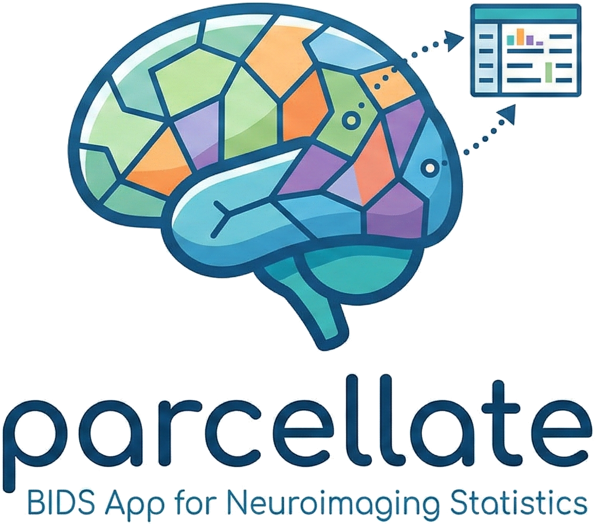

  

# parcellate

`parcellate` is a BIDS App for extracting regional statistics from scalar neuroimaging maps using atlas-based parcellation. It integrates with **CAT12** (VBM) and **QSIRecon** (dMRI) preprocessing pipelines and produces tidy TSV tables suitable for downstream analysis and quality control.

---

-   **Quick start**

    Install the package, configure your environment, and run your first parcellation.

    [:octicons-arrow-right-24: Getting started](getting_started.md)

-   **CAT12 guide**

    Process CAT12 VBM outputs: input layout, output format, masking, and TIV.

    [:octicons-arrow-right-24: CAT12 pipeline guide](cat12_guide.md)

-   **QSIRecon guide**

    Process QSIRecon diffusion outputs including 4D probabilistic atlases.

    [:octicons-arrow-right-24: QSIRecon pipeline guide](qsirecon_guide.md)

-   **API reference**

    Explore the VolumetricParcellator and the built-in statistical functions.

    [:octicons-arrow-right-24: API](api.md)

