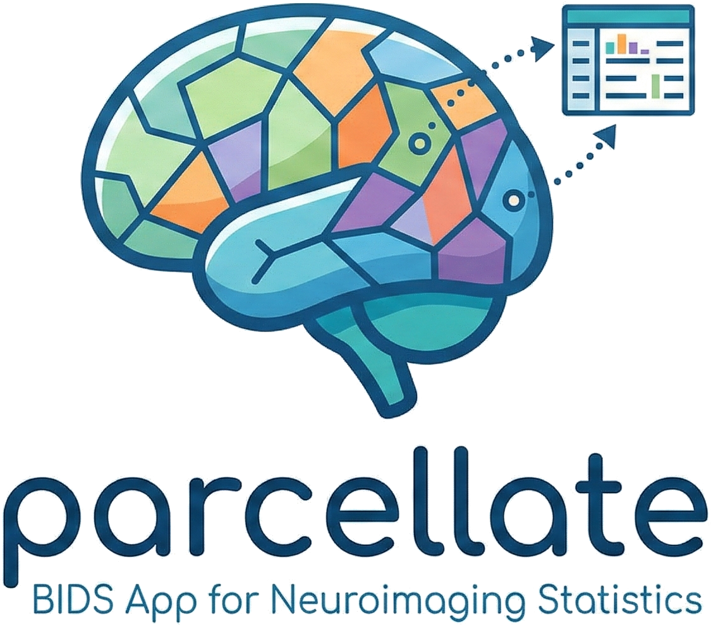

  

# parcellate

`parcellate` is a Python library for extracting regional statistics from scalar neuroimaging maps using atlas-based parcellation. It provides a scikit-learn–style `fit` / `transform` API that handles atlas resampling, masking, and aggregation — returning tidy `pandas.DataFrame` tables ready for downstream analysis.

---

-   **Quick start**

    Install the package and run your first parcellation in minutes.

    [:octicons-arrow-right-24: Getting started](getting_started.md)

-   **Usage guide**

    Atlases, lookup tables, resampling modes, probabilistic atlases, and custom statistics.

    [:octicons-arrow-right-24: Usage guide](usage.md)

-   **Metrics reference**

    All 45 built-in statistics organized into core, extended, and diagnostic tiers.

    [:octicons-arrow-right-24: Metrics reference](metrics_reference.md)

-   **API reference**

    Full API documentation generated from source docstrings.

    [:octicons-arrow-right-24: API](api.md)

